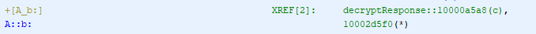

# FOX - Fix Objective-C XREFs

FOX is a Ghidra script to assist with reverse engineering of iOS apps. It locates all calls to *objc_msgSend* family functions, tries to infer the actual method that gets referenced, and updates cross-references accordingly. If the inferred *objc_msgSend* argument matches more than one method, it tries to determine the class of the called method. When this is not possible, it instead adds a plate comment to all potentially referenced methods that can be then checked manually, to avoid polluting the project with bogus XREFs. Furthermore, a PRE comment that includes the full msgSend call (if available) or potential candidates is added to all the msgSend calls to speed-up reversing activities. It can use the output of a Frida script to produce better results, using a list of all the ObjC functions available to the binary, including the ones residing outside the binary currently analyzed (e.g. system libraries, other binaries of the IPA, etc.). With this Frida list, the script is able to add XREFs also when class information is missing, if there is only one method name with the same signature.

Tested with Ghidra v9.2.3.

## Usage

### GUI mode
1.	Auto analyze your target binary with the default analyzers (at least)
2.	Copy the script into your ghidra_scripts directory
3.	Open the Script Manager in Ghidra and run the script
4.	You can also run it via the Tools > FOX menu or the shurtcut "X"
5.	Optionally supply the output of the attached Frida script when requested 
6.	Navigate newly updated XREFs, PRE and plate comments
 
### Headless mode
1.	Launch analyzeHeadless with -postScript FOX.java
2.	Optionally supply the output of the attached Frida script after the script name (ex. -postScript FOX.java fridaOutput.txt)
3.	Open Ghidra and navigate newly updated XREFs, PRE and plate comments

### Frida script
The Frida script purpose is to extract from the running app a list of all ObjC methods and classes, including system ones and related to other binaries packed in the IPA. It can create the list on the device memory (safer and a lot faster) or can dinamically download the list. This latter case is not safe when dealing with big binaries because it can crash the application. Creating the list in the device memory can be done in seconds without crashing the app even with huge binaries.

1.	Edit the extractFunctionList.py file, setting values for "device", "program_identifier", "program_spawn", "outputToDeviceFile" and "outputPath" fields (it is very simple and well documented)
2.	Run the python file
3.	With "outputToDeviceFile" to True, download the output file from the device memory

## Authors
- Federico Dotta -  Principal Security Analyst at HN Security
- Marco Ivaldi - Technical Director at HN Security

## References
- [FOX - Fix Objective-C XREFs in Ghidra](https://security.humanativaspa.it/fox-fix-objectivec-xrefs-in-ghidra/)

## Screenshots

- XREF added to msgSend call

- Inline comment added to msgSend function

- Inline comment with potential XREFs

- Plate comment with potential XREFs

